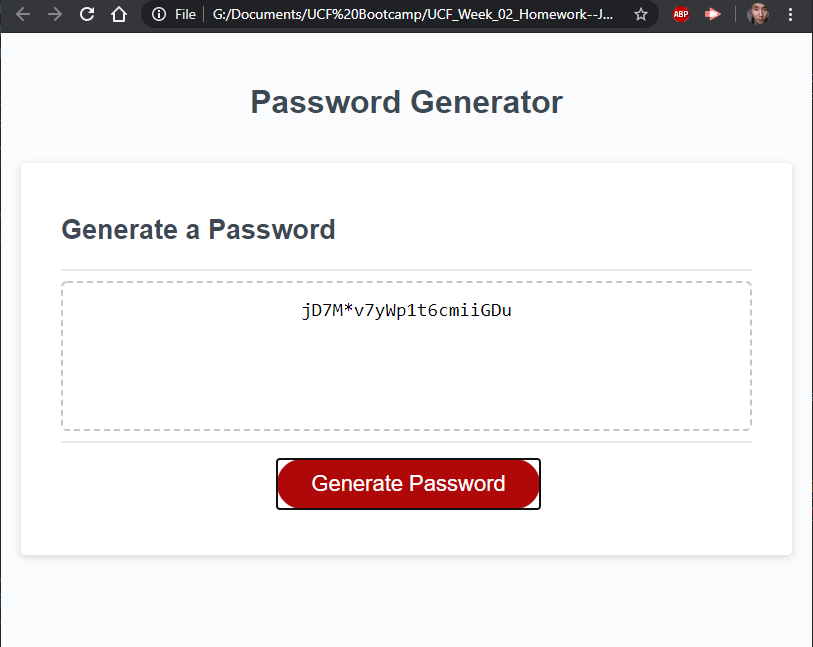

# UCF_Week_02_Homework--JavaScript
This repository contains the UCF Coding Boot camp homework where we create a web browser based password generator using the JavaScript language. The purpose of this homework is as an introduction to the JavaScript language and the logic of programming.

### Prerequisites and Deployment

* Installation of Web Browser to view webpage
* Visual Studio Code to analze the code for the website

## Built With

* Visual Studio Code

## Author

* **Lam Nguyen**

## License

There is no license with this homework assignment

## Screenshots

